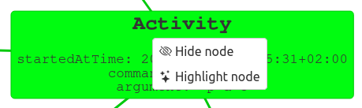
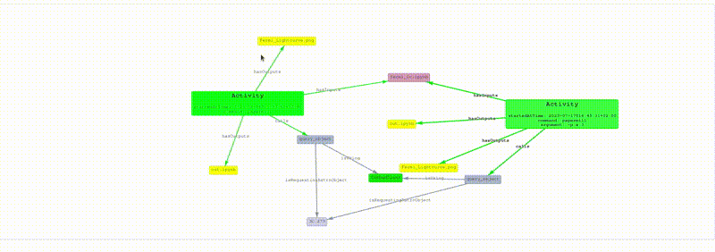
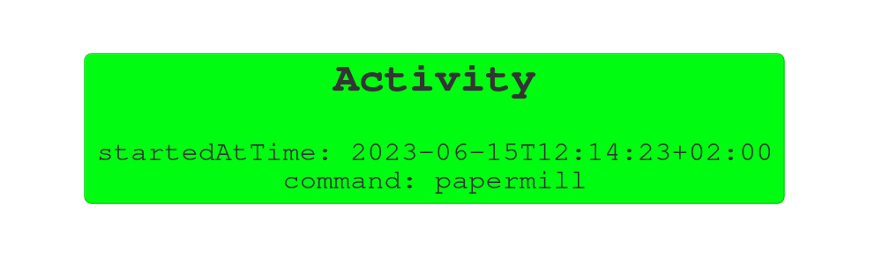
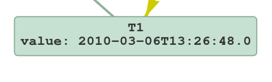
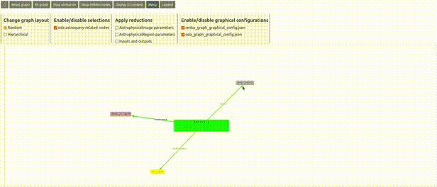
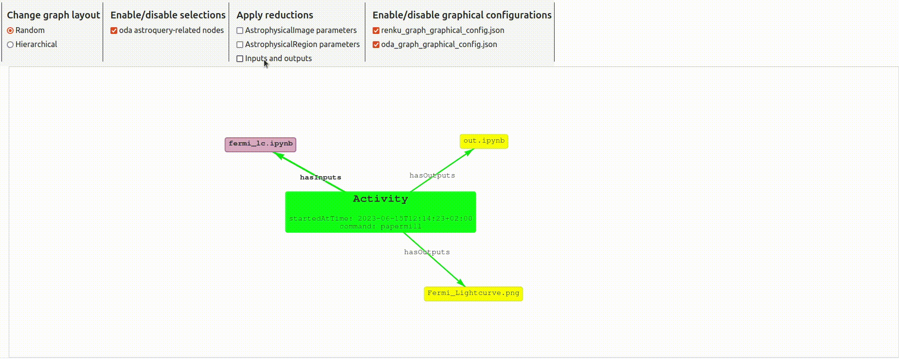

# renku-aqs-graph-library

The functionalities implemented within the `graph_helper.js` javascript module enable the interaction with the graph, as well as its graphical behavior. In particular:

* __graph drawing__: draw the graph starting from an export of the graph, currently `ttl` format is supported
* __graph user-interaction__: 
  * query the triples, thus drawing the relative nodes and edges directly connected to the clicked node
  * hide or highlight user selected node using a dedicated context menu
* __graph customization__: various types of configuration can be applied:
  * __graphical__
  * __subset selection of nodes__
  * __absorption/expansion of nodes__

This library is to be used in conjunction with the renku plugin [`renkgu-graph-vis`](https://github.com/oda-hub/renku-graph-vis/), which main output is an interactive representation of the project Knowledge Graph.

## Node context menu functionalities

When right-clicking on a node within the graph, a context menu appears as displayed in the image below.

<div align="center">

</div>

The context menu offers two primary actions:

* __Hide a Node__: This option allows users to hide the selected node. Hidden nodes can be unhidden using the dedicated button "Show hidden nodes".

* __Highlight node__: This option is currently implemented only for __Activity__ nodes. Choosing this option results in hiding all the nodes of this type within the graph, except the selected one. The highlight operation results in hiding also all the nodes that are related to the activities which nodes have been hidden. This feature helps users focus on a specific __Activity__. The animation below shows an example of an highlighting operation.

<div align="center">

</div>


## Graph configurations

### __graphical__

This JSON configuration file is used to define various graphical properties for the nodes within the graph. For the nodes, it defines the properties for each `rdf:type` (eg `owl:Class`).

<details>

<p><summary><b>List of properties for a node of the graph</b></summary></p>


Below is a detailed description of each property within the JSON object:

  *  __shape__ : Specifies the shape of the node. For example, "ellipse", "circle", "box".
  *  __color__ : Defines the backgroun color of the node. The color can be specified using hexadecimal values.
  *  __displayed_information__: Specifies the type of information displayed for the object. Options include "literals", "title", or "both", defaults to "both".
  *  __displayed_literals_format__ : Defines the format for displaying literals, in particular, for the given node type, which literals should be shown and whether or not with the relative title. The format is the following: "literal_name:yes/no" For example, "`parameter_name:no`" means the literal parameter_name will be displayed without the relative label, "`parameter_name:yes`" will instead display the title of the literal.
  *  __displayed_type_name__ (string): Specifies the title to display for the node type. It supports some HTML tags for text formatting, namely <b>bold</b>, <i>italic</i> and `code`. For instance, <i>OntologyClass</i> will render as italicized "OntologyClass".
  * __font__ (object): Contains font-related properties for customizing the object's text display.
    * __face__ : Specifies the font face, such as "courier", "arial", or "times".
    * __size__ : Determines the font size for the object's text.
    * __boldital__ : Contains properties for customizing bold and italic text.
      * __size__ : Specifies the font size for bold and italic text.

  </details>

### ___example___
For the nodes of type `Activity`, the title as well as all the literals properties will be displayed (along with the property name).
```json
"Activity": {
      "shape": "box",
      "color": "#00FC10",
      "font": {
        "face": "courier",
        "size": 24,
        "bold": {
            "size": 36
        }
    }
  }
```

<div align="center">

</div>


Instead for the nodes of type `StartTime` and `EndTime`, the title will not be displayed, and for the literal property `parameter_name` only the value will be displayed (eg `T1`) and for the value property instead the title and value will be displayed (`value: 2010-03-06T13:26:48.0`).

```json
"StartTime,EndTime": {
      "shape": "box",
      "color": "#bcddc9",
      "displayed_information": "literals",
      "displayed_literals_format": "parameter_name:no,value:yes"
  },
```

<div align="center">

</div>

### __selection of subset of nodes__

This JSON configuration file is used to define a list of separate set of properties, each related to a subset of nodes. For example, `oda` represents the astroquery derived nodes, so those generated by intercepting the astroquery calls, for example during the run of a notebook.

<details>

<p><summary><b>List of properties for a subset of nodes of the graph</b></summary></p>

Below is a detailed description of each property within the JSON object:

* __prefixes__ : This field lists the prefixes associated with the "oda"-related nodes. In the example below, those are "oda" and "odas".
* __description__ : This field provides a brief description of the related subset of nodes, and it will be visualized next to the related check-box.
* __query_construct__ : This field contains the CONSTRUCT part (for the related subset of nodes) of the SPARQL query used in the extraction of the overall graph.
* __query_where__ : This field contains the WHERE clauses (for the related subset of nodes) of the SPARQL query used in the construction of the overall graph.
* __ontology_url__ : This field provides the URL to the ontology file associated with the subset of ndoes, if this is available. Currently turtle is the only supported format.

</details>

### ___example___

For the `oda` subset the related json is the following.

```json
"oda": {
    "prefixes": "oda, odas",
    "description": "oda astroquery-related nodes",
    "query_construct": " ...",
    "query_where": " ... ",
    "ontology_url": "http://odahub.io/ontology/ontology.ttl"
  }
```

<div align="center">

</div>

### __absorption/expansion of nodes__

This JSON configuration file is used to define a list of absorption rules. In each of those are listed the predicates that, for a given class of nodes (eg `Activity`) can be "absorbed" inside the node. An example of this can be seen in the images below.

<details>

<p><summary><b>List of properties for a rule of absorptions of nodes in the graph</b></summary></p>

* __name__ : This field provides a brief description of the related set of rules, and it will be visualized next to the related check-box.
* __predicates_to_absorb__ : This field lists the predicates involved in the rule. In the example below, the absorbed nodes into the `Activity` nodes will be those that appear as objects in the triples where the predicate is one of those here listed (eg `hasOutputs`, `hasInputs`) and the subject is the `Activity` node.
</details>

### ___example___

For the `Activity` nodes.

```json
  "Activity": {
    "name": "Inputs and outputs",
    "predicates_to_absorb": "hasOutputs,hasInputs"
  }
```

<div align="center">

</div>


# Library usage

The module can be imported in the header as such:

```html
<script type="application/javascript" src="graph_helper.js"></script>
```

An examaple code that uses this library can be found [here](index.html), and the relative live version can be found [here](https://odahub.io/renku-aqs-graph-library/).

Otherwise the [`aqs` renku plugin](https://github.com/oda-hub/renku-aqs/tree/cli-display-graph) makes usage of this library to build the interactive graph via the `show-graph` command.

The following javascript libraries have been used:

* [Vis netowrk](https://github.com/visjs/vis-network) - to provide the means to draw nodes and edges, with animations and various graphical customization
* [N3](https://github.com/rdfjs/N3.js/) - a library that offers the functionalities to handle RDF, in particular to 
perform operations of parsing, writing and storing triples in several various formats (eg Turtle, TriG, N-Triples, N-Quads to name some), 
* [Comunica](https://github.com/comunica/comunica) - for querying the graph
